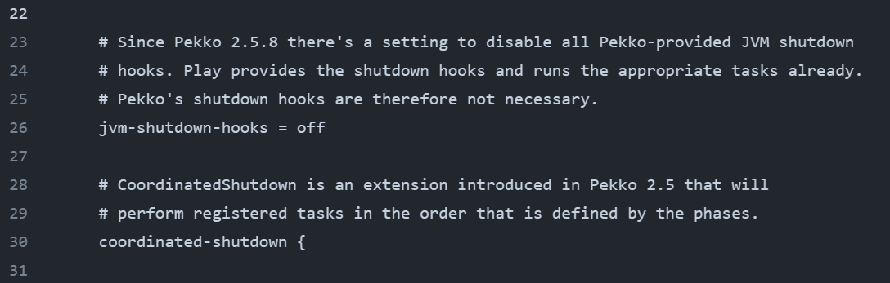
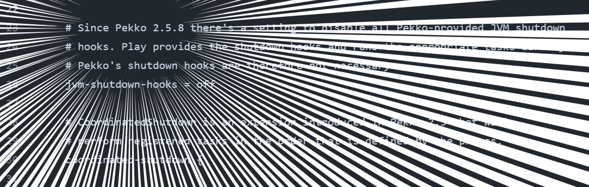

# OSS にコントリビュートしてみよう！ <!-- fit -->

[NB-Scala レトロスペクティブ](https://nextbeat.connpass.com/event/315988/)
ScalaMatsuri 2024後夜祭（非公式）

2024/06/14
harry0000

---

## 自己紹介

- harry0000
- GitHub: [harry0000](https://github.com/harry0000)
- Twitter (現: X): [@harry0000jp](https://x.com/harry0000jp)
  - もうほぼ使ってないです…
- 無職歴
  - 2014/07 ～ 2015/10
  - 2016/05 ～ 2017/03
  - 2020/12 ～ 2023/11
---

## LT のきっかけ

- [ScalaMatsuri 2024](https://2024.scalamatsuri.org/ja) が5年ぶりのオフライン開催
- 「[プログラム](https://2024.scalamatsuri.org/ja/programs)」とか見てると Scala 初心者の方も一定数いそうな気配
- "この手" の話は定期的に(無限に)してもよさそう

---

## というわけで(?)

月曜(2024/06/10)に [PlayFramework](https://github.com/playframework/playframework) (以下 Play)へコントリビュートしてきました

- Fix Pekko configuration value to match the official documentation [#12722](https://github.com/playframework/playframework/pull/12722)
- Fix comments for Pekko configurations [#12723](https://github.com/playframework/playframework/pull/12723)

---

## コントリビュートの経緯

- 仕事で Play 2.8.x から 3.0.x のマイグレーションをしていた
  - [2.8.22](https://github.com/playframework/playframework/releases/tag/2.8.22) で 2.8.x 系が EOL のため…
- Akka から Pekko への移行作業もあり、Play の設定ファイルを見ていた
- Pekko の Configuration と見比べると、コメントが少し古いというか違和感が…？

---

## [reference-overrides.conf](https://github.com/playframework/playframework/blob/3.0.3/core/play/src/main/resources/play/reference-overrides.conf#L23-L30)

---

### Pekko 2.5.8 <!-- fit -->

---

## 補足というか昔話

- Lightbend 社が Akka を 2.7 から商業ライセンス (BSL v1.1) へ移行することを発表
  - [Why We Are Changing the License for Akka](https://www.lightbend.com/blog/why-we-are-changing-the-license-for-akka)
    - 2022/09/07 の記事
  - 一応、3年後 (2025～2026?) に Apache 2.0 license へ戻る予定
- その後、Akka v2.6 から fork した Pekko が誕生
  - [2023/07 に 1.0.0 リリース](https://x.com/ApachePekko/status/1679611402225344520)
  - Apache Incubator を卒業後、2024/03 に Top-Level Project へ昇格
    - https://incubator.apache.org/projects/pekko.html
  - 現時点で最新版は **1.0.2**
- Play 2.9 系は Akka、3.0 系は Pekko を使っている

---

## プルリクチャ～ンス

- どうやら `Akka` から `Pekko` に機械的に置換した結果こうなってしまった模様
  - [Pekko #11847](https://github.com/playframework/playframework/pull/11847)
- 他には `jvm-exit-on-fatal-error = true` となっていたのを変更
  - 公式の設定例が `= on` で統一されていたため
    - [Default configuration · Apache Pekko Documentation](https://pekko.apache.org/docs/pekko/current/general/configuration-reference.html)
    - [Default configuration • Akka Documentation](https://doc.akka.io/docs/akka/current/general/configuration-reference.html)
  - [HOCON](https://github.com/lightbend/config/blob/main/HOCON.md) の記法的には[どちらでも良い](https://github.com/playframework/playframework/pull/12722#issuecomment-2157863093) (どちらも valid)

---

## プルリクで気をつけたこと (1/4)

気をつけたいこと、でもある

1. 1つのプルリクに複数の余計な変更を混ぜないこと
    - 例えば、「configuration のコメント修正」と「設定値の変更」は別プルリクで出しました
    - Why
      - メンテナーがレビューしやすい
      - プルリクごとにマージする/しないの取捨選択が可能になる
        - 設定値の変更に関しては、書き方の好みの問題でもある
        - 設定値の変更は 2.9.x & 3.0.x へバックポート可能だが、
          Pekko 関連のコメント修正は 3.0.x にしかバックポートできない、
          などの事情もあります

---

## プルリクで気をつけたこと (2/4)

2. [プルリクテンプレ](https://github.com/playframework/playframework/blob/main/.github/PULL_REQUEST_TEMPLATE.md)に確実に目を通して、要記載の所は全て埋める
    - [CoC](https://github.com/playframework/.github/blob/main/CODE_OF_CONDUCT.md) や [Contributor guidelines](https://github.com/playframework/.github/blob/main/CONTRIBUTING.md) などもよく読む
3. Background Context をちゃんと調べて記載する
    - 何らかの経緯があって今のコードになっているのかもしれない…
    - メンテナーであっても過去の経緯や変更をすべて詳細には把握してない
      - にんげんだもの
      - テンプレの [How to write the perfect pull request](https://github.blog/2015-01-21-how-to-write-the-perfect-pull-request/) にも書かれている
        - > don’t assume familiarity with the history.
    - 参考にした(なりそうな)資料があればリンクを記載する

---

## プルリクで気をつけたこと (3/4)

4. プルリク説明などの英文は DeepL や ChatGPT でよく推敲する
    - 頑張ろう…！
    - 各種ツールのおかげで大分簡単にはなりました
    - 今回の反省点として、設定値の変更は `Fix` ではなく `Change` とすべきでした…（1敗）
5. 既存コードの流儀に従って修正する
    - コメント修正では1行ごとの文字数に気をつけて適切な位置で改行しました
    - "変に"我を出そうとしない

---

## プルリクで気をつけたこと (4/4)

6. そもそもプルリクを出すべきなのか、よく考える
    - 実は一番重要かもしれない
    - Play の [Contributor guidelines](https://github.com/playframework/.github/blob/main/CONTRIBUTING.md) にも記載あり
      - 同じ問題が既に存在するか (重複してないか)
      - Forum で質問/ディスカッションすべきか
      - issue として報告すべきか
        - 再現コードや再現環境の記載をお忘れなく
      - 軽微なドキュメント修正はプルリクで OK
        - 今回はテストコード不要の軽微な修正 & 変更だったのでプルリクエストを出しました
    - この LT が「OSS にプルリクエストを出してみよう！」ではないことに注意

---

## どうコントリビュートするか

- 準備して丁寧なコントリビュートを心掛ける
  - 丁寧に調べると学びもある
- 普段使ってるツール/ライブラリ/フレームワークなどから始めるのが無難
  - 身近で興味があるもの
  - ドキュメント読んでると整備や更新が追い付いてなかったり
  - バグ報告とか機能リクエストのディスカッションとか
- もし自分から探しに行くなら…
  - リポジトリの CI 眺めると sbt task わかるし、warning 出てたらコントリビュートチャンスかも！？
  - [`good first issue`](https://github.com/playframework/playframework/labels/good%20first%20issue) ラベルがあるリポジトリでは、これを眺めてもよさそう？
- OSS にも穴はある

---

## Have a nice Contribution! <!-- fit -->
