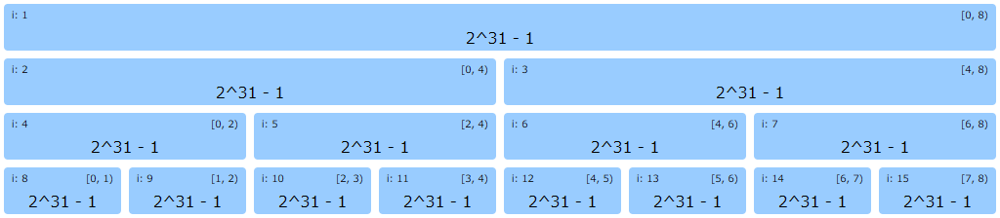
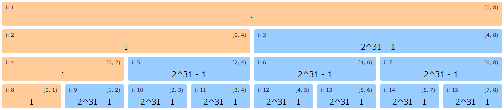
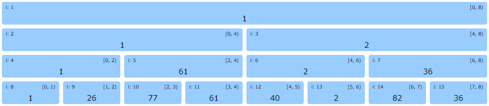
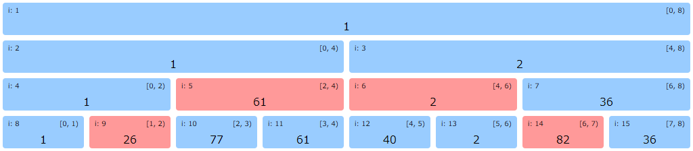

# モノイドについて <!-- fit -->

## あるいはモノイドの性質を利用したデータ構造について

社内勉強会用資料

2024/08

---

## モノイドとは

集合 $S$ とその上の二項演算 $•: S × S → S$ が与えられ、以下の2条件を満たすもの
(それ以上でも以下でもなく)

### 結合則

$S$ の任意の元(要素) $a, b, c$ に対して、$(a • b) • c = a • (b • c)$

### 単位元 $e$ が存在する

$S$ の元 $e$ が存在して、$S$ の任意の元 $a$ に対して $e • a = a • e = a$ となる

---

## モノイドの具体例

|演算|単位元 $e$||演算|単位元 $e$|
|:---:|:---:|:---:|:---:|:---:|
|数値加算 +|0||真偽値 OR `\|\|`|`false`|
|数値乗算 *|1||真偽値 AND `&&`|`true`|
|符号付き整数 `Min()`|`MaxValue`||bit OR `\|`|0|
|符号付き整数 `Max()`|`MinValue`||bit AND `&`|$2^N - 1$ (全 bit が 1)|
|符号無し整数 `Min()`|`MaxValue`||bit XOR `^`|0|
|符号無し整数 `Max()`|0||[`Validated[A, B]`](https://github.com/typelevel/cats/blob/v2.12.0/core/src/main/scala/cats/data/Validated.scala#L756-L764)|[`Valid(Bの単位元)`](https://github.com/typelevel/cats/blob/v2.12.0/core/src/main/scala/cats/data/Validated.scala#L917-L921)|
|文字列連結|`""`||...|...|

---

## 結合則が成り立たない例

- 減算
    - $(1 - 2) - 3 \ne 1 - (2 - 3)$
- 除算
    - $(6 \div 6) \div 6 \ne 6 \div (6 \div 6)$
- 冪演算
    - $a^{b^c}$
    - 必ず右から左に計算しないと正しい答えが得られない
- [NAND](https://proofwiki.org/wiki/NAND_is_not_Associative)
- [NOR](https://proofwiki.org/wiki/NOR_is_not_Associative)
- [ベクトルの外積](https://w3e.kanazawa-it.ac.jp/math/category/vector/henkan-tex.cgi?target=/math/category/vector/gaiseki.html)

※ 「減算」は符号付き数値型の「加算」、「除算」は有理数型の「乗算」に変形できれば大丈夫ではある

---

## 単位元がない演算の例

- 集合同士の共通部分 (intersection) を取る演算
    - 結合則は成り立つ
        - $(A ∩ B) ∩ C = A ∩ (B ∩ C)$
    - ただし、すべての集合と共通部分を取ったときに元の集合がそのまま残る集合 $e$ は存在しない

---

## 注意点

### 結合則であって交換則ではない

- 項の順番を入れ替えると普通に結果は変わる $^{*1}$
    - `"abc" + "def"` $\neq$ `"def" + "abc"`
    - `"1".invalidNel |+| "2".invalidNel`
        - $=$ `Invalid(NonEmptyList("1", "2"))`
        - $\neq$ `Invalid(NonEmptyList("2", "1"))` (入れ換えた場合)
- 演算する順番は変えても OK
    - `("a" + "b") + "c"` = `"a" + ("b" + "c")` = `"abc"`

### 単位元の存在確認は、$e • a = a • e$ 両方の確認が必要

- 交換則を前提としていないため

<span style="font-size: 0.5em;">1: もちろん交換則も満たしている演算は、変わりません</span>

---

## cats における結合則

[Semigroup](https://github.com/typelevel/cats/blob/v2.12.0/kernel/src/main/scala/cats/kernel/Semigroup.scala) (半群)

- 前述の「演算」が `combine()` に該当します

```scala
trait Semigroup[@sp(Int, Long, Float, Double) A] extends Any with Serializable { self =>
  def combine(x: A, y: A): A
}
```

[cats/syntax/semigroup.scala](https://github.com/typelevel/cats/blob/v2.12.0/core/src/main/scala/cats/syntax/semigroup.scala)

- `Semigroup` (結合則)を満たす型は `|+|` で結合できます

```scala
final class SemigroupOps[A: Semigroup](lhs: A) {
  def |+|(rhs: A): A = Semigroup[A].combine(lhs, rhs)
  def combine(rhs: A): A = Semigroup[A].combine(lhs, rhs)
}
```

---

## cats における Monoid

[Monoid](https://github.com/typelevel/cats/blob/v2.12.0/kernel/src/main/scala/cats/kernel/Monoid.scala)

- `Semigroup` に「単位元」を追加したもの
    - `empty` が「単位元」に該当します

```scala
trait Monoid[@sp(Int, Long, Float, Double) A] extends Any with Semigroup[A] { self =>

  /**
   * Return the identity element for this monoid.
   */
  def empty: A

  /**
   * Tests if `a` is the identity.
   */
  def isEmpty(a: A)(implicit ev: Eq[A]): Boolean =
    ev.eqv(a, empty)
}
```

---

## モノイドの何が嬉しいのか

[モノイド#計算機科学におけるモノイド: Wikipedia](https://ja.wikipedia.org/wiki/%E3%83%A2%E3%83%8E%E3%82%A4%E3%83%89#%E8%A8%88%E7%AE%97%E6%A9%9F%E7%A7%91%E5%AD%A6%E3%81%AB%E3%81%8A%E3%81%91%E3%82%8B%E3%83%A2%E3%83%8E%E3%82%A4%E3%83%89)

> 計算機科学において、多くの抽象データ型はモノイド構造を持つ。よくあるパターンとして、モノイド構造を持つデータ型の元の列を考えよう。この列に対して 「重畳」(fold) あるいは「堆積」(accumulate) の操作を施すことで、列が含む元の総和のような値が取り出される。例えば、多くの反復アルゴリズムは各反復段階である種の「累計」を更新していく必要があるが、モノイド演算の重畳を使うとこの累計をすっきりと表記できる。

---

## 区間最大/最小値問題

話は変わって、以下のような問題を考えます。

**問題** <span style="font-size: 0.75em">[Range Minimum Query (RMQ)](https://onlinejudge.u-aizu.ac.jp/courses/library/3/DSL/2/DSL_2_A)</span>

数列 $A = \{a_0, a_1, ..., a_{n-1}\}$ に対し、次の２つの操作を行うプログラムを作成せよ。

- $update(i,x)$: $a_i$ を $x$ に変更する。
- $find(s,t)$: $a_s, a_{s+1}, ..., a_t$ の最小値を出力する。

ただし、$a_i$ ($i = 0, 1, ..., n−1$)は、$2^{31} - 1$ で初期化されているものとする。

$q$ 行にクエリが与えられる。$com$ は、クエリの種類を示し、`0` が $update(x, y)$、`1` が $find(x, y)$ を表す。

```
com x y
```

各 $find$ クエリについて、最小値を１行に出力せよ。

---

## 区間最大/最小値問題

### 制約

- $1 \le n \le 100,000$
- $1 \le q \le 100,000$
- 実行時間制限: 2 sec 以内

### 要約

- 要は、与えられた区間中の最小値を答える問題
  - 区間は場合により様々
  - 値の更新もある
- 素朴にループで最小値を探すと、毎回区間が長い時に計算が間に合わない

---

## セグメント木

実は、区間の「最大/最小の値」や「総和」などを求めるのに便利なセグメント木 (segment-tree) というデータ構造があります

---

## セグメント木の構造



- 対象となる $N$ 個のデータが葉に収まるサイズの2分木を用意します
- 実際には配列
  - index 1からの方が計算しやすいので、index 0 は未使用
    - 自身の `index * 2` が左、`index * 2 + 1` が右の子ノードになる
    - 自身の `index / 2` が親ノードの index になる
  - 配列の後ろ半分が葉に該当し、対象の実データを格納
  - 配列の前半分の各ノードには、対応する区間の最小値を格納します

---

## セグメント木の更新



最初の値を 1 に更新する場合

1. 最初の値が格納されてる葉 `i: 8` を 1 に更新
2. `index / 2` しながら最小値を更新していく

1つの値を更新するのに必要な計算量は $O(\log N)$ $^{*2}$

<span style="font-size: 0.5em;">2: オーダー記法では $\log$ の底は省略しますが、厳密には $\log_2$ です</span>

---

## 更新後のセグメント木



- 8個の値でセグメント木を初期化した後の状態
- 区間毎に最小値が記録されている

---

## セグメント木の問い合わせ



半開区間 `[1, 7)` の最小値を求める場合

- `最小値 = Min(左の子ノードの最小値, 右の子ノードの最小値)` みたいな感じで  
  根から葉に向かって再帰的に潜っていく
- 子ノードに潜った時、「求める区間」と比較して処理を分岐
    - 部分的に含まれてた場合、更に潜る
    - 完全に含まれてた場合、そのノードの値を返す (赤色の4ノードが該当)
    - 完全に外れてた場合、初期値 $2^{31} - 1$ を返す (おっ？)

---

## もしかしてモノイドであればセグメント木で管理できる…？

**Yes！**

- 「初期値」とは、つまり単位元 $e$
    - $e • a = a • e = a$ なので、演算結果に影響しない
- `Min()` も `Max()` も `Sum()` もすべてモノイドである「二項演算」
- これらの演算をセグメント木の実装にベタ書きすると、モノイドの数だけ実装が必要になる…
- が、ある型 `T` の `Monoid[T]` があれば、セグメント木の実装はただ 1 つだけで OK ！

```scala
class Segtree[T: ClassTag](n: Int)(using m: Monoid[T]) { /* ... */ }

object Segtree {
  def apply[T: ClassTag : Monoid](values: Array[T]): Segtree[T] = { /* ... */ }
}
```

---

## モノイドは「作れる」$^{*3}$

**問題** <span style="font-size: 0.75em;">[AtCoder Beginner Contest 343 F - Second Largest Query](https://atcoder.jp/contests/abc343/tasks/abc343_f)</span>

長さ $N$ の数列 $A = (A_1, A_2, …, A_N)$ が与えられます。
$Q$ 個のクエリが与えられるので、与えられた順に処理してください。
各クエリは以下の 2 種類のいずれかです。

- タイプ 1: `1 p x` の形式で与えられる。$A_p$  の値を $x$ に変更する。
- タイプ 2: `2 l r` の形式で与えられる。$(A_l, A_{l+1}, …, A_r)$ において 2 番目に大きい値の個数を出力する。

**制約**

- $1 \le N,Q \le 2 \times {10^5}$
- $1 \le A_i \le 10^9$

<span style="font-size: 0.5em;">3: 自分で新たに定義できる、の意</span>

---

## この要求を満たすモノイドを考えてみる

- 問題があからさまに Range Query なのだ！
    - セグメント木で解けるかも？？？
- モノイドかどうか確認してみる
    - 2 番目に大きい値の個数を管理したいので、1 番目に大きい値とその個数も一緒に管理する
    - ```scala
      case class SLQ(first: Int, firstCount: Int, second: Int, secondCount: Int)
      ```
    - このインスタンスが 2 つある場合、それらの中で 1 番目と 2 番目に大きい値の個数は計算できそう
        - この処理が「二項演算」になる
    - 全部値が 0 なら、それが「単位元」になるのでは…？
        - 今回の場合 `SLQ(0, 0, -1, 0)` とか `SLQ(-1, 0, -2, 0)` でもよい
    - モノイドだ！

---

## 解けた！

```scala
import cats.Monoid

case class SLQ(first: Int, firstCount: Int, second: Int, secondCount: Int) {
  def countOf(value: Int): Int =
    if (first == value)       { firstCount  }
    else if (second == value) { secondCount }
    else                      { 0           }

  def getLessThan(value: Int): Int =
    if (first < value)       { first  }
    else if (second < value) { second }
    else                     { 0      }
}

object SLQ {
  def apply(value: Int): SLQ = SLQ(value, 1, 0, 0)

  given Monoid[SLQ] with {
    def empty: SLQ = SLQ(0, 0, 0, 0)

    def combine(x: SLQ, y: SLQ): SLQ = {
      val first = x.first.max(y.first)
      val second = x.getLessThan(first).max(y.getLessThan(first))
      val firstCount  = x.countOf(first)  + y.countOf(first)
      val secondCount = x.countOf(second) + y.countOf(second)

      SLQ(first, firstCount, second, secondCount)
    }
  }
}
```

---

## セグメント木の弱点

- 区間更新 (RUQ: Range Update Query) がある場合、計算量の改善が見込めない
    - 例
        - 区間 `[l, r)` を特定の値に置き換える
        - 区間 `[l, r)` の値を加減算する
    - 値を1個更新するのに $O(\log N)$ の計算量がかかるため
    - この場合、遅延セグメント木 (lazy-segment-tree) が使えます
        - ノードの更新を実際に区間データ取得が発生するまで遅延させるデータ構造

---

## まとめ

- モノイドは1つの二項演算と単位元をもつ代数的構造
    - 単位元をもつ半群（単位的半群）
- モノイドを満たすデータ構造の列は fold / reduce / accumurate などで  
  簡単に集約値を取り出せる
- モノイドは特定のデータ構造でも活用されている
    - セグメント木を使えば、任意の区間値を高速に取得できる
    - 遅延セグメント木であれば、区間更新にも対応可能

---

## 参考資料

- [モノイド - Wikipedia](https://ja.wikipedia.org/wiki/%E3%83%A2%E3%83%8E%E3%82%A4%E3%83%89)
- [競技プログラミングの鉄則 アルゴリズム力と思考力を高める77の技術](https://book.mynavi.jp/ec/products/detail/id=131288)
- [atcoder/ac-library](https://github.com/atcoder/ac-library)
    - AC Library is the official library of [AtCoder](https://atcoder.jp/home).
    - [Segtree](https://atcoder.github.io/ac-library/production/document_ja/segtree.html)
    - [Lazy Segtree](https://atcoder.github.io/ac-library/production/document_ja/lazysegtree.html)
- [rust-lang-ja/ac-library-rs](https://github.com/rust-lang-ja/ac-library-rs)
    - ac-library-rs is a rust port of AtCoder Library (ACL).
    - [Segtree](https://docs.rs/ac-library-rs/0.1.1/ac_library/segtree/struct.Segtree.html)
    - [Lazy Segtree](https://docs.rs/ac-library-rs/0.1.1/ac_library/lazysegtree/struct.LazySegtree.html)
- [論理回路 第2回 論理ゲートを用いる](https://www.info.kindai.ac.jp/LC/lecture/LogicCircuits02.pdf)
    - NANDとNORが結合則を満たさない証明など (P.27, 32, 59)
